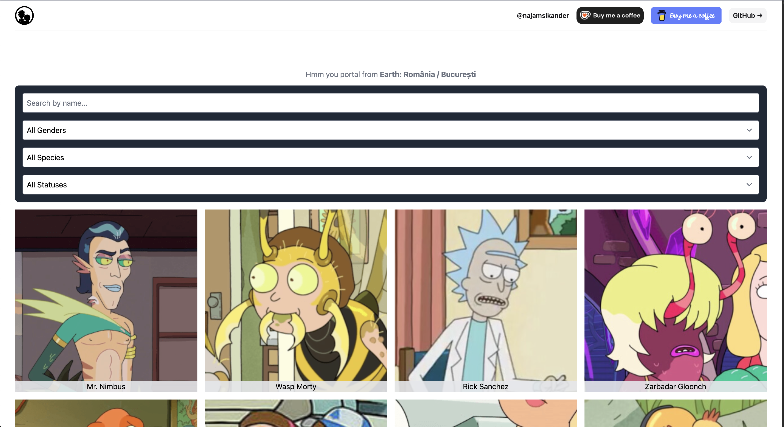
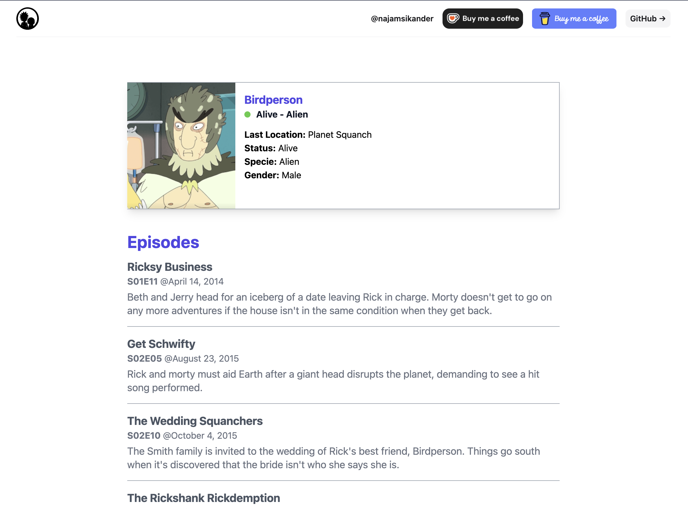

# RickMorty Umbrella
This is an [Elixir](https://elixir-lang.org/) and [Phoenix/LiveView](https://phoenixframework.org/) app based on an Elixir umbrella project. Kudos to [Rick and Morty API](https://rickandmortyapi.com/) for providing a wonderful API. On startup, this project loads data from the [Rick and Morty API](https://rickandmortyapi.com/) and stores textual data in a JSON file, which serves as our store, while images are downloaded as well. 

This auto download behavior is controlled by config settings **auto_fetch_data** for api and frontend project. Default value is **true**.
Introduced this so we are not pressuring rick and morty api for json data and images.
```
config :api, auto_fetch_data: false
config :frontend, auto_fetch_data: false
```

<a href="https://www.buymeacoffee.com/najamsk" target="_blank">

</a>
<a href="https://ko-fi.com/C0C71E7JQK" target="_blank"></a>

## API Project

Inside our umbrella project, the `Api` app is responsible for serving a simple REST API based on the `characters.json` file we compiled using the Rick and Morty API.

## FrontEnd Project

As the name suggests, it serves the UI to users with a characters list that can be filtered based on user input. Data is fetched from the `Api` project, and images are served from this project using the `images` folder and character IDs.

## Screenshots

  


## Installation & Run

Clone the repo, then in your terminal, open the root of the project and run:

```bash
mix deps.get
```

We are using https://www.omdbapi.com/ to fetch episode plots and this site requires api key. Sign up there for free key and then pass that on using environment variable. 


```
#bash 
export OMDB_API_KEY=8XXXXX

#fish
set -x OMDB_API_KEY 8XXXX
```

To run the frontend and API from the root, execute the following:

```bash
iex -S mix phx.server
```

Use following to run iex with qualified name and cookie so other nodes or livebook can join this node.
```bash
iex --name app@127.0.0.1 --cookie mycookie -S mix phx.server
```
Now in livebook you can use attach mode and provide following to connect
```
Name= app@127.0.0.1 
Cookie= mycookie 
```

## TODO(s)

- [X] API and FrontEnd both should have a config boolean setting like auto download to fetch data (json+images) form rick and morty api. Default will be false since repo has characters.json and images already.
- [X] Fetching data from rick and morty api and loading data into persistent_term should be call independently form application start function. So if we don't want to get new data we can read data from json file into persistent_term and serve from there.
- [X] show list of episodes on character details screen.

## Support
<a href="https://www.buymeacoffee.com/najamsk" target="_blank">

</a>
<a href="https://ko-fi.com/C0C71E7JQK" target="_blank"></a>