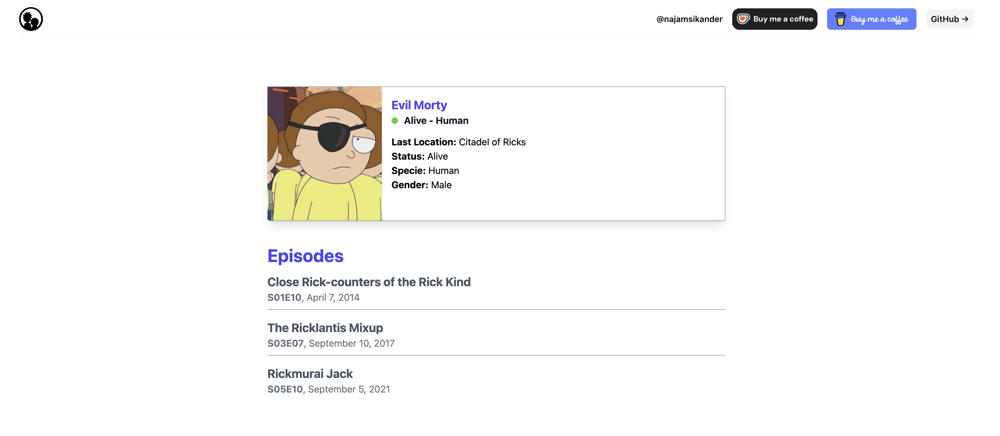

# RickMorty Umbrella
This is an elixir, phoenix/LiveView app based on elixir umbrella project. Kudos to https://rickandmortyapi.com/ for a wonderful api. This project on startup will load data from https://rickandmortyapi.com/ api and store textual data in json file that will serve as our store and images will be downloaded as well. 

## API Project
Inside our umbrella project Api app(project) is responsible to serve a simple rest api based on the characters.json file we compiled using rick and morty api.

## FrontEnd Project
As name suggest It will be serving UI to user with charactesr list that can be filtered based on user input. Data is fetched from API project and images are served from this project using images folder and character ID.

**TODO: Add description**

## Screenshots

## Installation & Run
Clone the repo then in your terminal open root of the project and run:

    mix deps.get

To run the front and api from root run following

    iex -S mix phx.server

